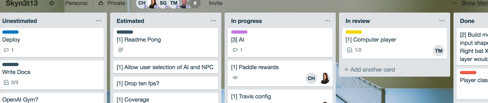
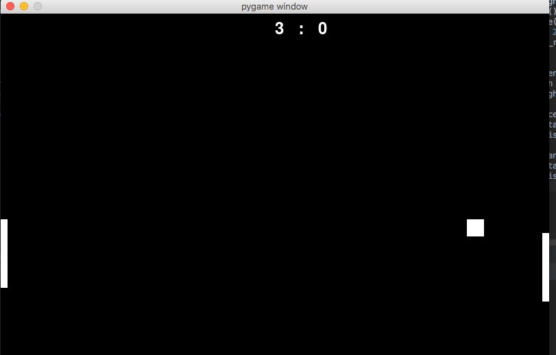

# Pong

Pong is an arcade video game released in 1972. It has two-dimensional graphic replicating a table tennis game.

## Description

This version of Pong was implemented as final group project for the Makers Academy bootcamp, as an experimentation of machine learning.

## Approach

- MVP: 2-user input basic Pong game
- Goal: AI learning and controlling one of the bats
- We used 2-day sprints, with the first Monday set aside for general planning and `pygame` familiarisation
- We held a planning meeting at the beginning of each sprint in order to decide priorities, estimate ticket complexity and assign tickets into the sprint.
- We used Trello to manage our tickets and process, as this snapshot illustrates:

## Team's personal goals for the project

- Picking up new technologies
- Experimenting with AI
- Having fun
- Learning from each other
- Getting a good product to showcase

#### Progress

- We successfully completed an MVP of the Pong game by Wednesday afternoon of the 1st week.
- Thursday was spent reading and learning about some of the AI frameworks and methodologies we could use and selecting a technology.
- On Friday we implemented our first primitive version of the AI, which proved to be very bad at playing Pong. 
- We left it learning over the weekend and, as it didn't improve (in fact, got worse, compared to random actions), we identified the need for 
further configuration and understanding of the machine learning framework.

## Installation

- install python in your OS (NB: if on a Mac, don't use Homebrew, go directly to python.org to avoid bugs with pygame displays)
- clone locally and navigate to the root folder
- install pipenv if not already installed (`pip install pipenv`)
- run `pipenv install`
- run `pipenv shell` to enter the execution environment
- run 'python3 app.py' to execute the app

#### Testing

- Execute `pytest` in the project root. 100% passing tests.

#### Linting

- Execute `pylint ping/*.py` in the project root. 10/10 pylint rating. 

#### Coverage

- Enter the pipenv shell if not already in there (`pipenv shell`)
- Execute `pytest --cov=ping`
- We're working on it :) 

## Instructions for use
- Player 1 controls are `W` and `S` to move the left paddle up and down, respectively.
- Player 2 controls are `Up arrow` and `Down arrow` for the right paddle.
- The score is displayed centrally and increments whenever a player manages to strike the opposing player's wall.
- There is currently no win condition or game reset, because we wanted the AI to be able to train without interruption.
- The game may be quit with the `Esc` key.

## Screenshots and videos

The basic user interface, with score at the top:

An illustration of early learning:

